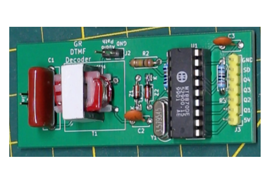

# DTMF_Decoder
MT8870 DTMF decoder for POTS phone line interfacing  
 
Note: It is recommended to only connect this circuit to a phone line after it is taken off hook to keep the AC voltages low, such as audio signals and not a high voltage ring signal. 
This can be achieved by switching the circuit into the phone line with a relay.  
This circuit has only been tested on a simulated phone line in a workshop environment and is not guaranteed to meet official telephone line specifications.
